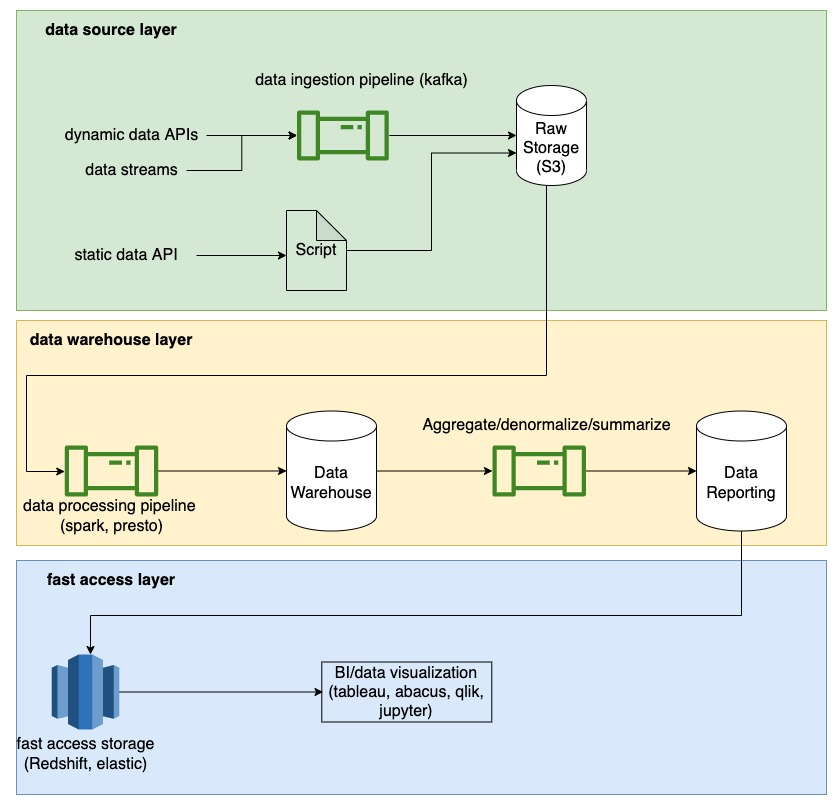

# data-infra

## PRFAQ

A highly abstract data infra skeleton that aimed to be extendable and scalable, to power data driven computations on top of it, including ETL, real-time streaming, data categorizing, interactive query and fast accessing.

### FAQs

##### What are some obvious benefits that it brings?

* It bootstraps a data infrastructure for users to quickly plug in their data source and start working.
* It goes beyond a "burner" data warehouse that users create and discard every time for their short-lived data work. It supports data streaming.
* It does NOT solely rely on a single cloud provider, which would become a single point of failure, but is pluggable for various cloud providers and open source solutions.
